# MedGuard360 — NC Enterprise Landscape

> Reference document mapping the North Carolina DHHS, NC Medicaid, Medicare, and statewide billing ecosystem, and showing where MedGuard360 sits as a fraud-prevention + billing platform. Pilot states: NC (primary), SC, GA.
>
> Last verified: 2026-05-22. Where information is fluid, items are tagged `[Confirm via …]`.

---

## 1. NC DHHS Organizational Map

NC DHHS is organized into ~30+ divisions and programmatic offices across six service areas: **Health, Opportunity and Well-Being, Medicaid, Operational Excellence, External Affairs, and Licensing and Facilities** ([NC DHHS Overview](https://www.ncdhhs.gov/about/overview), [NC DHHS Divisions](https://www.ncdhhs.gov/divisions-and-programmatic-offices)). Secretary: Devdutta Sangvai ([Org Chart](https://www.ncdhhs.gov/dhhs-orgchart)).

| # | Division / Office | Acronym | Mission / Scope | Claims / Service Flow | MedGuard360 Intersection |
|---|---|---|---|---|---|
| 1 | Division of Health Benefits | **DHB** (NC Medicaid) | Operates NC Medicaid + NC Health Choice for ~3.1M beneficiaries | All Medicaid claims (FFS via NCTracks + managed care via PHPs/Tailored Plans) | **Primary integration target.** Claims, eligibility, PA, fraud, encounters |
| 2 | Division of Medical Assistance (legacy) | DMA | Predecessor to DHB; name retired but appears in older statutes/forms | n/a (folded into DHB) | Legacy nomenclature in 42 CFR refs |
| 3 | Division of Mental Health, Developmental Disabilities, and Substance Use Services | **DMHDDSUS** | Policy + oversight for BH/IDD/SUS; LME/MCO oversight | Tailored Plan encounters, 1915(c) Innovations + TBI waivers, state-funded BH | Tailored-plan claims engine, 42 CFR Part 2 consent handling, BH fraud patterns |
| 4 | Division of Public Health | **DPH** | Statewide public health: communicable disease, WIC, maternal/child health, immunizations, environmental health | Title V, vaccines, lead, vital records; some Medicaid claims via LHDs | Public health reporting (ELR/eCR), syndromic surveillance feed |
| 5 | Division of Social Services | **DSS** | Child welfare, adult protective, energy/work-first assistance; county-administered | Medicaid eligibility intake, foster-care services, NEMT eligibility | Eligibility verification, foster-care + CFSP linkage |
| 6 | Division of Child Development and Early Education | **DCDEE** | Licensing child care, NC Pre-K, subsidy program | Child care subsidy claims (not Medicaid) | Cross-reference for EI/birth-to-3 children |
| 7 | Division of Aging and Adult Services | **DAAS** (formerly DAAS/Division of Aging) | Older Americans Act, Adult Protective Services, family caregiver, in-home aide | State + federal HCBS; CAP/DA touchpoint | LTSS fraud, adult-care-home billing oversight |
| 8 | Division of State Operated Healthcare Facilities | **DSOHF** | Runs 14 state-operated facilities (3 psychiatric hospitals, 3 NRC for IDD, ADATCs for SUD, neuro-medical) | Direct facility billing to Medicare/Medicaid/private | Facility EHR-to-claims pipeline, dual-eligible billing |
| 9 | Division of Services for the Blind | **DSB** | Vision rehab, independent living for blind/VI | State funding; some Medicaid waiver overlap | Provider directory dimension |
| 10 | Division of Services for the Deaf and Hard of Hearing | **DSDHH** | Communication access, interpreter services | Limited Medicaid (interpreter as covered service in some plans) | Member-language attribute in eligibility |
| 11 | Division of Vocational Rehabilitation Services | **DVR** | Employment services for people with disabilities | Order-of-Selection; some Medicaid waiver coordination | HCBS coordination |
| 12 | Division of Health Service Regulation | **DHSR** | Licenses + surveys all health facilities (hospitals, NF/SNF, ACH, hospice, home health, adult care) | Licensure data is upstream of Medicaid enrollment | **See `integrations/nc-dhsr/`** — facility license verification connector |
| 13 | Division of Child and Family Well-Being | **DCFW** | Combined children's health (school nursing, EI/CDSA, child health, BH for kids) | Birth-to-3 (CDSA), school-based BH, child Medicaid | EI/birth-to-3 billing, CFSP coordination |
| 14 | Division of Employment and Independence for People with Disabilities | **DEIPD** | Successor to DVR portfolio in some org charts `[Confirm current name]` | Disability employment | Limited |
| 15 | Office of Rural Health | ORH | Loan-repayment for clinicians, FQHC/RHC support, telehealth | Grants; not direct claims | FQHC/RHC provider-type identification |
| 16 | Office of Procurement, Contracts, and Grants | OPCG | Department procurement | n/a | Vendor contracts (BAA, MSA) live here |
| 17 | Office of the Controller | | Department finance | All Medicaid disbursements reconciled here | Financial reconciliation feed |
| 18 | Office of Internal Audit | OIA | Department-level audit | Audit findings; refers to OCPI | Fraud-engine output feeds audit |
| 19 | Office of the Chief Information Officer | DHHS-OCIO / DIT | IT, security, NCID identity | All systems incl. NCTracks integration | NCID OAuth/SAML for provider login |
| 20 | Office of Communications | | External comms | n/a | Public-facing notifications |
| 21 | Office of Human Resources | | DHHS HR | n/a | n/a |
| 22 | Office of Government Affairs | | Legislative liaison | n/a | n/a |
| 23 | Office of Citizen Services / CARELINE | | Constituent intake | n/a | Member complaint/grievance triage |
| 24 | Office of Economic Opportunity | OEO | LIHEAP, weatherization, CSBG (Community Services Block Grant) | Federal block-grant claims (non-Medicaid) | SDOH cross-reference |
| 25 | Office of the General Counsel | OGC | Legal | n/a | BAA + DUA review |
| 26 | Office of Equity & Inclusion | OEI | Health equity, language access | Equity reporting | Disparities dashboard |
| 27 | Office of Policy and Strategic Initiatives | | Policy coordination | n/a | n/a |
| 28 | NC Pre-K (under DCDEE) | | Universal pre-K subsidy | Subsidy claims | n/a |
| 29 | Office of Compliance & Program Integrity (under NC Medicaid / DHB) | **OCPI** | Fraud / waste / abuse for Medicaid | Pre/post-pay reviews, RAC, data analytics | **Direct downstream consumer of fraud-engine alerts** ([OCPI](https://medicaid.ncdhhs.gov/meetingsnotices/office-compliance-program-integrity-ocpi)) |
| 30 | NC State Center for Health Statistics | SCHS (under DPH) | Vital records, BRFSS, registries | Death/birth feeds | Death-match decedent-claim suppression |

> **Note on count:** the NC DHHS overview cites 33 divisions/offices across the six service areas ([NC DHHS Overview](https://www.ncdhhs.gov/about/overview)). The table above lists the operationally-relevant ones; smaller program offices (e.g., NC Office of State Human Resources liaison, IT shared services) are omitted but `[Confirm via NC DHHS org chart](https://www.ncdhhs.gov/dhhs-orgchart)`.

---

## 2. NC Medicaid — Programs & Populations

### Total enrollment

- ~3.1M North Carolinians enrolled in NC Medicaid in CY2025 ([NCDOJ MID FY25 report referenced in NCDHHS press release](https://www.ncdhhs.gov/news/press-releases/2026/04/16/secretary-sangvai-attorney-general-jackson-update-legislature-medicaid-fraud-prevention-and)).
- Expansion (effective Dec 1, 2023) added ~600K+ adults 19–64 up to 138% FPL; ~450K enrolled by May 2024 ([NC Medicaid Expansion](https://medicaid.ncdhhs.gov/north-carolina-expands-medicaid)). Current expansion enrollment `[Confirm via Expansion Dashboard](https://medicaid.ncdhhs.gov/reports/medicaid-expansion-dashboard)`.

### Programs / sub-populations

| Population | Description | Eligibility Hook |
|---|---|---|
| **TANF / Family & Children** | Parents/caretakers + dependent children | Income-based, MAGI |
| **ABD** | Aged 65+, Blind, Disabled | Categorical + asset-tested |
| **Pregnant Women / Be Smart** | Up to 196% FPL pregnancy + 12-month postpartum | MAGI |
| **NC Health Choice (CHIP)** | Children 6–18 up to 211% FPL (separate CHIP rolled into Medicaid for under-6 in 2014; older kids historically separate). Largely merged into Medicaid expansion era — `[Confirm program status post-expansion](https://medicaid.ncdhhs.gov/)` |
| **Family Planning Be Smart** | Limited-benefit family planning waiver | Income up to 195% FPL |
| **Medicaid Expansion** | Adults 19–64, up to 138% FPL, no kids requirement | Effective 2023-12-01 |
| **Dual Eligibles** | Medicare + Medicaid | See below |

### Dual eligibles (Medicare + Medicaid)

- **Full duals (QMB Plus / SLMB Plus)**: Medicare-eligible with full Medicaid benefits.
- **QMB only** (Qualified Medicare Beneficiary): Medicaid pays Part A/B premiums + cost-sharing.
- **SLMB only** (Specified Low-Income Medicare Beneficiary): Medicaid pays Part B premium.
- **QI** (Qualifying Individual): Part B premium assistance, 120–135% FPL.
- **QDWI** (Qualified Disabled Working Individual): Part A premium for disabled workers.

**Crossover flow:** Medicare adjudicates first → COBA (Coordination of Benefits Agreement) at CMS auto-forwards Part A/B claim to NC Medicaid via NCTracks → Medicaid pays cost-share per state plan. Pharmacy crossover via TrOOP for Part D.

### Waivers

| Waiver | Authority | Population | Operator | Notes |
|---|---|---|---|---|
| **NC Innovations** | 1915(c) HCBS | I/DD (incl. autism, CP, Down, pre-22 TBI) | Tailored Plans (Alliance/Partners/Trillium/Vaya) | Capped slots; long waitlist ([NC Innovations](https://medicaid.ncdhhs.gov/beneficiaries/nc-innovations-waiver)) |
| **TBI Waiver** | 1915(c) HCBS | Adult TBI (injury at age 18+) | Tailored Plans (region-restricted pilot) | |
| **CAP/C** | 1915(c) HCBS | Medically fragile children up to 21 | Acentra (case mgmt via NC LIFTSS) | Alternative to NF/hospital |
| **CAP/DA** | 1915(c) HCBS | Disabled adults 18+ | Acentra (NC LIFTSS) | Alternative to NF |
| **1115 Healthy Opportunities Pilots** | 1115 demo | SDOH (housing, food, transport, IPV) | 4 regional Network Leads | **Currently paused** as of 2025-07-01 due to NCGA funding gap; federal waiver renewed Dec 2024 for 5 years allowing statewide option ([HOP Update](https://medicaid.ncdhhs.gov/blog/2025/06/02/healthy-opportunities-pilots-update)) |

### Health Plans (Managed Care)

NC Medicaid Managed Care launched 2021-07-01 for Standard Plans; Tailored Plans launched 2024-07-01 ([Tailored Plan Launch](https://www.ncdhhs.gov/news/press-releases/2024/04/10/july-1-launch-behavioral-health-and-intellectualdevelopmental-disabilities-tailored-plans)).

**Standard Plans (5 prepaid health plans / PHPs):**
1. **AmeriHealth Caritas North Carolina**
2. **Carolina Complete Health** (provider-led; NC Medical Society + NC Community Health Center Assoc. + Centene)
3. **Healthy Blue** (BCBSNC)
4. **UnitedHealthcare Community Plan of NC**
5. **WellCare of NC** — merging into Carolina Complete Health effective 2026-04-01 `[Confirm post-merger plan count]`

**Tailored Plans (4 LME/MCOs)** for serious BH/IDD/TBI:
1. **Alliance Health** (Durham, Wake, Mecklenburg, Cumberland, Johnston, Orange, Vance, others)
2. **Partners Health Management**
3. **Trillium Health Resources**
4. **Vaya Health**

(LME consolidation collapsed earlier 6 to 4 in 2024.)

**Specialty / niche plans:**
- **EBCI Tribal Option** — first Indian Managed Care Entity in nation; ~4,000 enrollees in Cherokee/Graham/Haywood/Jackson/Swain + opt-in counties ([EBCI Tribal Option](https://medicaid.ncdhhs.gov/ebci-tribal-option-overview)).
- **Children and Families Specialty Plan (CFSP)** — launched 2025-12-01, operated by **Healthy Blue Care Together** (not CCNC; the prior assumption in the original prompt is outdated). ~32,000 enrollees: current/former foster youth + young adults to 26 + their minor children ([CFSP Launch](https://www.ncdhhs.gov/news/press-releases/2025/12/01/north-carolina-launches-children-and-families-specialty-health-plan)).
- **CCNC (Community Care of NC)** — historically the PCCM network; **no longer the primary Medicaid delivery vehicle** post-managed-care transition. Still provides care coordination services as a subcontractor in some plans `[Confirm current role]`.

---

## 3. Medicare in NC

| Metric | Value | Source |
|---|---|---|
| Total Medicare beneficiaries (NC, Sep 2024) | 2,227,758 | [healthinsurance.org](https://www.healthinsurance.org/medicare/north-carolina/) |
| Medicare Advantage share | ~56% | same |
| Stand-alone Part D | 642,395 | same |
| MA-PD (Part D inside MA) | 1,163,101 | same |

**Parts:**
- **Part A** (Hospital) — Palmetto GBA JM
- **Part B** (Physician/Outpatient) — Palmetto GBA JM
- **Part C** (Medicare Advantage) — private plans (Humana, UHC, BCBSNC, Aetna, Wellcare, Devoted, Alignment, etc.)
- **Part D** (Drug) — private PDPs/MA-PDs; CMS oversight

**MAC assignments (NC):**
- **A/B MAC: Palmetto GBA, Jurisdiction JM** (NC, SC, VA, WV) — [Palmetto JM](https://palmettogba.com/jma), [CMS JM page](https://www.cms.gov/Medicare/Medicare-Contracting/Medicare-Administrative-Contractors/Who-are-the-MACs-A-B-MAC-Jurisdiction-M-JM). JM totals 2,920,331 FFS beneficiaries.
- **DME MAC: CGS Administrators, Jurisdiction C** — covers NC. (The prompt's "Noridian Jurisdiction A" is **incorrect**; Noridian JA is the Northeast. NC's DMEPOS suppliers bill **CGS** for Jurisdiction C, which covers AL, AR, CO, FL, GA, LA, MS, NC, NM, OK, PR, SC, TN, TX, VI, VA, WV.) `[Confirm via [CMS MAC info](https://www.cms.gov/mac-info)]`
- **HH+H MAC** (Home Health & Hospice): Palmetto GBA serves the Southeast region including NC `[Confirm]`.
- **National Supplier Clearinghouse** (DMEPOS enrollment) — Palmetto GBA, applies nationally.

**Crossover (COBA):** NC Medicaid receives Medicare-paid claims for dual eligibles via the CMS Benefits Coordination & Recovery Center (BCRC) under the Coordination of Benefits Agreement. Claims arrive at NCTracks as 837 with COBA flag; NCTracks adjudicates cost-share per state plan.

---

## 4. Statewide Billing Entities (Who bills NC Medicaid / Medicare)

| # | Entity Type | Common NC Provider Type / Taxonomy | Typical Workflow | Primary Payer Path |
|---|---|---|---|---|
| 1 | Individual practitioners | MD/DO (PT 001), PA (097), NP (096), CRNA (012), CNM (011) | 837P → NCTracks (FFS) or PHP; Medicare via Palmetto B | Both |
| 2 | Hospitals — acute / CAH / LTACH / IRF / psych | PT 030 (Acute), 031 (CAH), 032 (Psych), Type-of-Bill 11x/12x/13x | 837I → Medicare A or NCTracks/PHP | Both |
| 3 | FQHC + RHC | PT 053 (FQHC), 054 (RHC) | All-inclusive PPS rate; Medicare wrap; UDS reporting | Both |
| 4 | Behavioral health (LCSW, LCMHC, LMFT, LCAS) + PRTFs | PT 251 (LCSW), 252 (LCMHC), PT 233 (PRTF) | 837P to Tailored Plan; some FFS for state-funded only | Mostly NC Medicaid (Tailored) |
| 5 | Nursing facilities (SNF/NF), ACH, family care homes | PT 042 (NF), 043 (SNF), 045 (ACH) | UB-04/837I monthly; CMS MDS 3.0 | Both |
| 6 | Home health | PT 060 | OASIS + 837I to Palmetto HH; 837 to PHP | Both |
| 7 | Hospice | PT 061 | Per-diem; NOE/NOTR via Palmetto | Both |
| 8 | Pharmacy (indep / chain / LTC / specialty / 340B) | NCPDP-enumerated | NCPDP D.0 real-time to OptumRx (NC Medicaid PBM); Medicare D via plan PBMs | Both |
| 9 | DMEPOS suppliers | NCPDP/NSC + Medicaid PT 080 | 837P to CGS JC (Medicare DME); to NCTracks for Medicaid | Both |
| 10 | NEMT brokers + transport | PT 142 (NEMT) | Statewide brokers contracted per plan (ModivCare, MTM, etc.); see `integrations/nemt-brokers/` | Mostly Medicaid |
| 11 | Dental | PT 122 (Gen Dentist), 123 (Specialist) | 837D (ADA dental claim) to NCTracks/PHP | Mostly Medicaid |
| 12 | Vision (OD / optician) | PT 070 / 071 | 837P; eyewear vendor for materials | Both |
| 13 | School-based services (LEAs) | PT 161 | Medicaid-in-schools (IEP-driven); annual cost reconciliation | NC Medicaid only |
| 14 | CAP/C PCS + private duty nursing | PT 048 PDN, PT 144 PCS | Service Plan via Acentra LIFTSS; 837P to NCTracks | NC Medicaid only |
| 15 | CAP/DA HCBS | PT 050 case mgmt | Same flow via Acentra LIFTSS | NC Medicaid only |
| 16 | Early Intervention (birth to 3 / CDSA) | PT 245 EI | DCFW-administered; some Medicaid billable services | Hybrid |
| 17 | Public health departments (county LHDs) | PT 029 | Bills Medicaid for clinical svcs; grant-funded for population health | Hybrid |
| 18 | Crisis / mobile crisis / BHUC / FBC | PT 238 (FBC), 219 (Mobile Crisis) | Tailored Plan adjudicates; some state-funded | Tailored Plan |
| 19 | ICF/IID | PT 044 | Per-diem to NCTracks | NC Medicaid only |
| 20 | Adult care home / family care home | PT 045 / 046 | State/County Special Assistance + Medicaid PCS | Hybrid |
| 21 | Tribal IHS / 638 providers (EBCI) | PT 029 + IHS facility code | OMB-encounter rate; through EBCI Tribal Option | NC Medicaid (EBCI TO) |
| 22 | SUD treatment (OTPs, MAT, SUD residential) | PT 226 OTP, 232 SUD Res | Tailored Plan; 42 CFR Part 2 consent required | Tailored Plan |

> Provider-type codes above use NCTracks Provider Type taxonomy. `[Confirm exact PT codes against current [NCTracks Provider Manuals](https://www.nctracks.nc.gov/content/public/providers/provider-manuals.html)]`.

---

## 5. NCTracks Service Boundary

**Operator:** Currently Gainwell (post-CSRA/CSC); Provider Data Management / CVO replacement awarded to **Optum**, launch anticipated 2026 ([NCMS update](https://ncmedsoc.org/ncdhhs-updating-provider-enrollment-and-data-management-system-components-of-nctracks/)).

### NCTracks DOES handle

- **FFS claim adjudication** for NC Medicaid Direct (non-managed-care) population: ABD, dual partials, foster pre-CFSP transitions, Medicaid Direct holdouts.
- **Encounter data ingestion (EPS)** from all PHPs and PIHPs — Institutional, Professional, and Pharmacy encounters ([NCTracks encounter data](https://www.nctracks.nc.gov/)).
- **Provider Enrollment (PES)** — all NC Medicaid providers (FFS *and* managed-care network) must enroll here per 42 CFR 438.602(b).
- **Pharmacy POS** — NCPDP claims via OptumRx for FFS; Medicaid Drug Rebate.
- **270/271 eligibility verification** — single source-of-truth, returns plan assignment.
- **NPI / taxonomy registry** for state.
- **EVV** (Electronic Visit Verification) aggregation for HHCS + PCS.
- **Cost-settlement (FQHC/RHC/LEA/PHD).**

### NCTracks DOES NOT handle

- **Managed-care PA workflows** — each PHP/Tailored Plan has its own UM system (Healthy Blue uses Carelon, AmeriHealth uses NIA/AIM, etc.).
- **Managed-care claim adjudication** — PHP pays provider directly; PHP then submits 837 *encounter* to NCTracks EPS within 30 days.
- **Plan-specific provider directories / network attestations** — each plan maintains; CMS Interop API (CMS-9115-F) applies per plan.
- **Member appeals / grievances** at the plan level — plans run internal; NC Medicaid Ombudsman is the escalation.
- **MA / Part D** — out of scope entirely.

---

## 6. Compliance / Regulatory Surface

### Federal

| Regulation | Coverage |
|---|---|
| **HIPAA Privacy & Security**, 45 CFR 160 / 164 | PHI handling, BAAs, breach notification |
| **42 CFR 455** (Subparts B, C, E) | Provider screening, ownership disclosure, risk levels (limited / moderate / high), site visits, fingerprint-based criminal background checks |
| **42 CFR 456** | Utilization control / medical necessity |
| **42 CFR Part 2** | SUD records — heightened consent, distinct from HIPAA |
| **45 CFR 162** | HIPAA EDI transaction & code-set standards (X12 5010, NCPDP D.0) |
| **21st Century Cures Act** + **ONC HTI-1 / HTI-2 / HTI-3** | Info-blocking, USCDI versions, EHR certification (HTI-3 in rulemaking as of 2026 `[Confirm]`) |
| **CMS Interoperability & Prior Authorization Final Rule, CMS-0057-F** | Patient Access API, Provider Access API, Payer-to-Payer API, PA API (FHIR R4 + DTR/CRD/PAS implementation guides); compliance dates phased through 2027 |
| **HITECH** | Enhanced HIPAA enforcement |
| **False Claims Act** (31 USC 3729) | Federal fraud civil enforcement |
| **Anti-Kickback Statute** (42 USC 1320a-7b), **Stark** (42 USC 1395nn) | Referral / financial relationships |

### NC State

| Statute | Subject |
|---|---|
| **NCGS Chapter 108A** | Medical assistance / Medicaid program |
| **NCGS Chapter 131E** | Health care facilities licensure |
| **NCGS Chapter 131D** | Domiciliary homes / ACH licensure |
| **NCGS Chapter 122C** | MH/DD/SUS, LME/MCO authority |
| **NCGS Chapter 90** (Articles) | Medical practice acts, prescribing, professional licensure |
| **NCGS Chapter 58** | Insurance, MA plans, PBM regulation |
| **NCGS 90-414.1 to 90-414.12** | NC HIE Act — mandatory NC HealthConnex connection for state-funded providers (enforcement currently suspended) ([NC HIEA mandate](https://hiea.nc.gov/providers/what-does-law-mandate)) |
| **NCGS 108A-70.5x** | Medicaid recipient eligibility audit |

### Enforcement bodies

- **NC Medicaid Office of Compliance & Program Integrity (OCPI)** — pre/post-pay reviews, RAC, data analytics, internal investigations ([OCPI](https://medicaid.ncdhhs.gov/meetingsnotices/office-compliance-program-integrity-ocpi)).
- **NC DOJ Medicaid Investigations Division (MID)** — criminal/civil prosecution; the federally certified MFCU. Recovered **$1.2B+ lifetime, $296M+ from 2019–2025** (8th-highest MFCU recovery; ROI 6.28× federal funds invested) ([NCDOJ MID](https://ncdoj.gov/responding-to-crime/health-fraud/), [Apr 2026 legislative update](https://www.ncdhhs.gov/news/press-releases/2026/04/16/secretary-sangvai-attorney-general-jackson-update-legislature-medicaid-fraud-prevention-and)). FY25 funding: $8.45M federal + $2.82M state.
- **NC SBI Medicaid Criminal Investigations** — criminal investigations of provider fraud ([NCSBI](https://ncsbi.gov/Divisions/Professional-Standards/Medicaid-Criminal-Investigations.aspx)).
- **NC Office of the State Auditor (OSA)** — financial + performance audits, including Medicaid eligibility audits under NCGS 108A-70.51.
- **DHHS Internal Audit (OIA)** — department-level.
- **CMS** (federal) — focused Program Integrity Reviews of states ([2022 NC PI focused review](https://www.cms.gov/files/document/north-carolina-fy-2022-pi-focused-review-final-report.pdf)).

**Fraud referral flow:** Tip / data signal → **OCPI** triage → if credible criminal allegation → referral to **NC DOJ MID** (or SBI for non-provider crimes) → prosecution + recoupment. CMS-required reporting via T-MSIS + UPIC (Qlarant for NC) in parallel.

In FY2025 NC OCPI/MID investigated 158 credible member-fraud allegations and 228 provider-fraud allegations across 114,454 enrolled providers ([Apr 2026 update](https://www.ncdhhs.gov/news/press-releases/2026/04/16/secretary-sangvai-attorney-general-jackson-update-legislature-medicaid-fraud-prevention-and)).

---

## 7. MedGuard360 Enterprise Solution Layout

### 7.1 ASCII / Mermaid architecture

```mermaid
flowchart TB
  subgraph FED["FEDERAL TIER"]
    CMS[CMS / CMCS]
    OIG[HHS-OIG]
    ONC[ONC]
    BCRC[CMS BCRC — COBA]
    TMSIS[T-MSIS]
  end

  subgraph STATE["NC STATE TIER — NC DHHS"]
    DHB[DHB / NC Medicaid]
    DMHDDSUS[DMHDDSUS]
    DPH[DPH]
    DHSR[DHSR Licensure]
    OCPI[OCPI Program Integrity]
    DOJ[NC DOJ MID]
    OSA[Office of State Auditor]
    NCID[NCID Identity]
  end

  subgraph SYS["STATE OPERATING SYSTEMS"]
    NCTracks[(NCTracks MMIS<br/>FFS + PES + EPS)]
    NCHC[(NC HealthConnex HIE<br/>SAS-operated)]
    LIFTSS[(Acentra NC LIFTSS<br/>CAP/C CAP/DA)]
    OptumRx[(OptumRx PBM)]
    PalmettoJM[(Palmetto GBA JM<br/>Medicare A/B)]
    CGS[(CGS Jurisdiction C<br/>DMEPOS)]
  end

  subgraph PHP["MANAGED CARE"]
    STD["Standard Plans (5)<br/>AmeriHealth · CCH · Healthy Blue · UHC · WellCare→CCH"]
    TP["Tailored Plans (4)<br/>Alliance · Partners · Trillium · Vaya"]
    CFSP["CFSP — Healthy Blue Care Together"]
    EBCI["EBCI Tribal Option"]
    NEMT["NEMT Brokers"]
  end

  subgraph MG["MedGuard360 PLATFORM"]
    direction LR
    GW[API Gateway / mTLS]
    subgraph SVC["20 Microservices"]
      CLAIM[claims-service]
      ELIG[eligibility-service]
      PA[prior-auth-service]
      PROV[provider-service]
      MEM[member-service]
      PAY[payment-service]
      EDI[edi-service]
      FHIR[fhir-service]
      HIE[hie-service]
      DOC[document-service]
      AUDIT[audit-service]
      NOTIF[notification-service]
      BIO[biometric-service]
      CONS[consent-service]
      STATE_CFG[state-config-service]
      RPT[reporting-service]
      ENC[encounter-service]
      PHARM[pharmacy-service]
      DENT[dental-service]
      DME[dme-service]
    end
    subgraph AI["10 AI Engines"]
      FRAUD[fraud-engine]
      RISK[risk-scoring]
      CODING[coding-assist]
      DUP[dup-detection]
      ANOM[anomaly-detection]
      NLP[clinical-nlp]
      OCR[ocr-engine]
      PRED[predictive-utilization]
      NETW[network-graph]
      BHV[behavioral-biometrics]
    end
  end

  subgraph PROV_TIER["PROVIDER TIER"]
    HOSP[Hospitals / FQHC / RHC]
    PRACT[Practitioners]
    BH[BH / SUD / PRTF]
    LTC[NF / SNF / ACH / ICF-IID]
    PHARM_P[Pharmacies]
    DMEP[DMEPOS]
    DENT_P[Dental / Vision]
    HH_HOSP[Home Health / Hospice]
    SCHOOL[LEAs]
    TRIBAL[EBCI / IHS]
  end

  subgraph MEM_TIER["MEMBER TIER"]
    APP[Mobile App]
    PORTAL[Member Portal]
  end

  CMS --> TMSIS
  TMSIS <-->|T-MSIS extract| NCTracks
  BCRC -->|COBA 837| NCTracks
  DHB --> NCTracks
  DHB --> PHP
  OCPI <-->|case files| DOJ
  OSA -.audit.-> NCTracks

  PROV_TIER -->|837/270/278| GW
  MEM_TIER -->|FHIR Patient Access| GW
  PHP <-->|encounters 837| GW
  NCTracks <-->|EDI X12 + FHIR| GW
  NCHC <-->|FHIR R4 / ENS| HIE
  PalmettoJM -.crossover.-> NCTracks
  OptumRx <-->|NCPDP D.0| PHARM

  GW --> SVC
  SVC <--> AI
  FRAUD -->|alerts| OCPI
  AUDIT -->|SIEM feed| OSA
  NCID -->|OAuth/SAML| GW
```

### 7.2 Connector inventory

| # | Counterparty | Direction | Transport | Identity | Use case |
|---|---|---|---|---|---|
| 1 | NCTracks (FFS claims) | Outbound + inbound | X12 837P/I/D, 835, 277CA via SFTP | Trading-partner ID + PGP | FFS claim submission, RA receipt |
| 2 | NCTracks (eligibility) | Outbound | X12 270/271 + FHIR Coverage | mTLS + OAuth2 client-credentials | Real-time eligibility |
| 3 | NCTracks (PA) | Outbound | X12 278 + FHIR PAS | OAuth2 | Prior auth for FFS |
| 4 | NCTracks (PES) | Outbound | REST + SFTP roster | API key + mTLS | Provider directory sync |
| 5 | NCTracks (encounters) | Outbound | X12 837 EPS | SFTP + PGP | Encounter submission on behalf of plan partners |
| 6 | Standard Plans (5) | Bi-directional | FHIR R4 + X12 | OAuth2 (per-plan) | Claims, PA, eligibility, encounter |
| 7 | Tailored Plans (4) | Bi-directional | FHIR R4 + X12 + 42 CFR Part 2 consent | OAuth2 + SMART-on-FHIR | BH claims, Innovations waiver svcs |
| 8 | CFSP (Healthy Blue Care Together) | Bi-directional | FHIR R4 + X12 | OAuth2 | Foster youth coverage |
| 9 | EBCI Tribal Option | Bi-directional | FHIR R4 + X12 | OAuth2 | Tribal enrollee claims |
| 10 | Palmetto GBA JM (Medicare A/B) | Outbound | X12 837 via EDI-SS / EDI Gateway | Submitter ID + cert | Medicare primary for duals |
| 11 | CGS JC (DME MAC) | Outbound | X12 837P + CMN | Submitter ID | DMEPOS |
| 12 | OptumRx (NC Medicaid PBM) | Outbound | NCPDP D.0 | NCPDP processor BIN/PCN | Pharmacy POS |
| 13 | NC HealthConnex / NC HIEA | Bi-directional | FHIR R4 (Bulk Data), C-CDA, ADT HL7v2 (ENS) | OAuth2 + SMART | HIE query, ENS notifications |
| 14 | Acentra NC LIFTSS | Bi-directional | REST + flat-file | API key | CAP/C, CAP/DA service plans + PCS PA |
| 15 | NEMT Brokers (ModivCare / MTM / etc.) | Bi-directional | REST + 837P | OAuth2 | Trip auth + claim |
| 16 | NC DHSR Licensure | Inbound | CSV / REST | API key | Facility license verification (see `integrations/nc-dhsr/`) |
| 17 | NC HIEA ENS | Inbound | HL7v2 ADT subscription | mTLS | Real-time admit/discharge notifications |
| 18 | T-MSIS extract | Outbound | flat-file via state | n/a (state-level) | Federal Medicaid statistical reporting |
| 19 | OCPI fraud alerts | Outbound | REST webhook + secure email | mTLS + OAuth2 | Fraud-engine alert forwarding |
| 20 | NCID | Inbound auth | SAML 2.0 + OIDC | Federation | Provider/staff SSO |
| 21 | CMS Interop APIs (per CMS-0057-F) | Bi-directional | FHIR R4 (Patient Access, Provider Access, Payer-to-Payer, PA API) | SMART-on-FHIR | Compliance + member data sharing |
| 22 | NC SCHS vital records | Inbound | flat-file | SFTP + PGP | Death-match suppression |
| 23 | Biometric device gateway | Inbound | proprietary + REST | device cert + mTLS | Provider/member biometric verification |

---

## 8. NC HealthConnex (NC HIE)

- **Authority:** NC Health Information Exchange Authority (**NC HIEA**), established as a division of NC Department of Information Technology (Government Data Analytics Center). Statutory basis: NCGS 90-414.1 et seq. ([About NC HIEA](https://hiea.nc.gov/about-us)).
- **Platform vendor:** **SAS Institute** (Cary, NC) operates the underlying HIE platform.
- **Mandate:** NCGS 90-414.4 requires all health care providers/entities receiving state funds (Medicaid, State Health Plan, etc.) to submit demographic + clinical data for state-funded encounters. Statutory deadline was 2023-01-01, but **enforcement is currently suspended** pending NCGA reforms ([What Does the Law Mandate](https://hiea.nc.gov/providers/what-does-law-mandate)). Good-faith effort = signed participation agreement.
- **Services:**
  - Clinical Portal (query-based exchange)
  - Encounter Notifications Service (**ENS**) — ADT-based admit/discharge/transfer alerts
  - Image Exchange
  - FHIR R4 endpoints (Patient Access, Bulk Data per ONC)
  - Public health gateway (eCR, ELR via DPH)
- **MedGuard360 `hie-service` integration:**
  - Subscribes to ENS for in-network member ADT events → triggers care-coord and fraud-anomaly checks (e.g., billing for in-office E/M while patient inpatient elsewhere).
  - Queries Clinical Portal via FHIR for documentation supporting PA decisions.
  - Submits MedGuard-aggregated encounter summaries (where applicable per BAA + DUA).

---

## 9. NC Medicaid Program Integrity Workflows

### 9.1 Lifecycle

1. **Detection** — algorithmic (OCPI data analytics, UPIC/Qlarant), provider/member tip line (1-877-DMA-TIP1), DHHS OIA, OSA audit findings, MedGuard360 fraud-engine alert.
2. **Triage** at OCPI: clinical + statistical review, sampling, RAC scope.
3. **Pre-payment review hold** (claim-suspend) or **post-payment recoupment** initiated.
4. **Credible allegation of fraud (CAF)** under 42 CFR 455.23 → **payment suspension**.
5. **Referral** to NC DOJ Medicaid Investigations Division (MID) for criminal/civil prosecution; or NC SBI Medicaid Criminal Investigations Unit.
6. **Sanction**: termination from Medicaid (cross-state via CMS T-MSIS/PECOS), False Claims Act suit, restitution, exclusion.
7. **Recovery** booked to state + federal share (FMAP-weighted).

### 9.2 Stats (FY2025)

- 3.1M enrollees; 114,454 enrolled providers
- 158 credible member-fraud allegations, 228 provider-fraud allegations investigated
- $296M+ recovered 2019–2025 (cumulative MFCU); $1.2B+ lifetime
- ROI 6.28× per federal funding dollar
- ([Apr 2026 NCDHHS/AG report](https://www.ncdhhs.gov/news/press-releases/2026/04/16/secretary-sangvai-attorney-general-jackson-update-legislature-medicaid-fraud-prevention-and))

### 9.3 MedGuard360 fraud-engine → OCPI handoff

- Alert payload: provider NPI, claim batch IDs, statistical confidence, scheme classification (e.g., upcoding, phantom billing, NEMT mileage padding, identity theft, dead-patient billing, kickback ring graph), supporting evidence bundle.
- Transport: signed JSON over mTLS REST to OCPI ingestion endpoint `[Confirm endpoint spec via DHB IT]`.
- SLA: high-severity (active large-loss) alerts within 4h; routine batched daily.
- `audit-service` retains immutable case file (WORM) for 10y per NCGS retention.

---

## 10. Funding & Federal Matching

### FY2026 (Oct 1, 2025 – Sep 30, 2026) FMAP

- Federal Register publishes annual FMAP table ([2024-27910](https://www.federalregister.gov/documents/2024/11/29/2024-27910/federal-financial-participation-in-state-assistance-expenditures-federal-matching-shares-for)).
- **NC traditional FMAP FY2026:** ~65% `[Confirm exact rate via [KFF FMAP table](https://www.kff.org/medicaid/state-indicator/federal-matching-rate-and-multiplier/)]`. NC has historically been in the 63–67% band; expansion has not changed this.
- **Expansion FMAP:** **90% federal / 10% state** — guaranteed by ACA. NC's expansion statute (SL 2023-7) has a **trigger** that auto-repeals expansion if federal expansion match falls below 90%.
- **Administrative match:** generally 50% federal; certain functions higher (MMIS O&M 75%, MMIS DDI 90%, eligibility systems 75/90, fraud detection systems 75%/50% per 42 CFR 433.111 categories).
- **OBBB Act (HR 1):** ended temporary enhanced ARPA expansion FMAP effective 2026-01-01 — does not affect NC because NC's enhanced bonus expired earlier ([NC Medicaid OBBB impact](https://medicaid.ncdhhs.gov/beneficiaries/impact-hr-1-and-federal-changes-medicaid), [Smith Law analysis](https://www.smithlaw.com/newsroom/publications/obbb-act-brings-major-medicaid-changes-what-north-carolina-providers-need-to-know)).

### Why FMAP matters for MedGuard360

- **MMIS-adjacent functions** (claims, PA, encounter aggregation, fraud detection) qualify for **enhanced federal match (75% O&M, 90% DDI)** if MedGuard360 is procured as a state MMIS module under CMS MITA + Streamlined Modular Certification (SMC).
- **Fraud detection algorithms** qualify under 42 CFR 433.111(b)(2) for enhanced match.
- Pricing model implication: state pays only ~25% of MMIS O&M; price-sensitivity of state procurement is lower for federally-matched line items.

---

## 11. Pilot State Roadmap

### Phase 1 states (per `state-config-service`): **NC, SC, GA**

| Axis | **North Carolina** | **South Carolina** | **Georgia** |
|---|---|---|---|
| Medicaid program brand | NC Medicaid | SC Healthy Connections Medicaid | Georgia Medicaid + PeachCare for Kids |
| Single state agency | NC DHHS / DHB | **SCDHHS** | **DCH** (Dept of Community Health) |
| MMIS / fiscal agent | **Gainwell** (NCTracks); PDM/CVO replacement → **Optum** 2026 | SC MMIS (SC Medicaid Portal) — operator `[Confirm vendor]` | **GAMMIS** — **Gainwell Technologies** since 2010 (succeeded DXC/HP) ([GAMMIS](https://www.mmis.georgia.gov/portal/PubAccess.Member%20Information/tabId/47/Default.aspx)) |
| Total enrollment | ~3.1M | ~1.4M `[Confirm SCDHHS]` | ~2.0M `[Confirm DCH]` |
| Expansion | YES (Dec 2023) | NO (non-expansion) | NO — Georgia Pathways limited demo |
| Managed care model | 5 Std PHPs + 4 Tailored Plans + CFSP + EBCI | 5 MCOs (Absolute Total Care, Healthy Blue, Humana Healthy Horizons, Molina, Select Health, First Choice) `[Confirm]` | 4 CMOs (Amerigroup, CareSource, Peach State, Wellcare) `[Confirm]` |
| BH carve-out | Tailored Plans (4 LME/MCOs) | Mostly integrated | Mostly integrated |
| HIE | NC HealthConnex (NC HIEA) | SC HIE / SCHIEx | Georgia HIN (GaHIN) |
| MFCU | NC DOJ MID | SC AG Medicaid Fraud Control Unit | GA AG MFCU |
| MAC (A/B) | Palmetto JM | Palmetto JM | Palmetto JJ (GA, AL, TN) |
| DME MAC | CGS JC | CGS JC | CGS JC |
| 1115 waivers | Medicaid transformation + HOP (paused) | Healthy Connections Works (work req demo) | Pathways to Coverage (work req partial expansion) |
| MedGuard360 readiness | Highest — primary pilot | Medium — needs SC connector specs | Medium — GAMMIS Gainwell connector via 837/270 standard |

**Cross-state similarities** simplify reuse: all three are JM Palmetto for Medicare, all three CGS JC for DME, all three Gainwell-related for MMIS (NC + GA confirmed; SC `[Confirm]`). Differences cluster in managed-care plan rosters + 1115 waiver footprints + HIE platform vendor.

---

## 12. Enterprise Readiness Checklist

> What MedGuard360 needs to be production-grade as a statewide solution.

### 12.1 Contracts / Legal

- [ ] **Business Associate Agreements (BAA)** with:
  - NC DHHS / DHB
  - Gainwell (NCTracks operator)
  - Optum (PDM/CVO post-2026)
  - Each of 5 Standard Plans
  - Each of 4 Tailored Plans
  - Healthy Blue Care Together (CFSP)
  - EBCI Tribal Option (with applicable IHCIA carve-outs)
  - OptumRx
  - NC HIEA
  - Each NEMT broker
- [ ] **Data Use Agreements (DUA)** under NC DHHS template; CMS DUA for any CMS data
- [ ] **Subcontractor BAAs** (cloud, biometric vendor, OCR vendor, NLP)
- [ ] **Participation Agreement** with NC HIEA
- [ ] **Trading Partner Agreements** with NCTracks, Palmetto, CGS, each PHP
- [ ] **42 CFR Part 2 Qualified Service Organization Agreement (QSOA)** for SUD data

### 12.2 Certifications / Attestations

- [ ] **HITRUST CSF r2** certification (preferred over SOC 2 alone for state-Medicaid procurements)
- [ ] **SOC 2 Type II** (annual)
- [ ] **NIST 800-53 Rev 5** controls mapping — Moderate baseline minimum, High for federal CMS data
- [ ] **StateRAMP** authorization (Moderate) — required by an increasing number of state Medicaid agencies
- [ ] **FedRAMP Moderate** — required if hosting any federal data (T-MSIS extracts, Medicare COBA data)
- [ ] **CMS MARS-E 2.2** compliance for FTI handling (if eligibility includes IRS data)
- [ ] **CMS MITA 3.0** maturity self-assessment (Level 3+ across business processes)
- [ ] **CMS Streamlined Modular Certification (SMC)** for MMIS-adjacent modules
- [ ] **PCI-DSS** (if member-pay or cost-share collection)
- [ ] **ONC HTI-1 / HTI-2 / HTI-3** certification for any EHR-classified components `[Confirm scope]`

### 12.3 Security ops

- [ ] HIPAA Security Risk Assessment (annual)
- [ ] Third-party penetration test (annual + post-major-release)
- [ ] Continuous vuln scanning + monthly patching SLA
- [ ] 24×7 SOC + SIEM (forwarding to NC DIT ESRMO `[Confirm]`)
- [ ] Encryption at rest (FIPS 140-3) + in transit (TLS 1.3)
- [ ] FIPS-validated cryptographic modules
- [ ] PHI tokenization for non-care use
- [ ] Insider-threat program

### 12.4 Resilience

- [ ] **Disaster Recovery Plan** — RPO ≤ 1h, RTO ≤ 4h for core claims/eligibility
- [ ] **Business Continuity Plan** with NC DHHS coordination
- [ ] Multi-region active-active (East-region for data-residency)
- [ ] Annual DR exercise with NC DHHS witness
- [ ] Backup retention: 10y for claims (NCGS 108A retention), 7y minimum HIPAA, indefinite for fraud cases

### 12.5 Data residency & sovereignty

- [ ] All NC member PHI stored in **US-East regions** within US-sovereign cloud (AWS GovCloud US, Azure Gov, or commercial with FedRAMP attestation)
- [ ] No offshore PHI access (including no offshore support engineers viewing PHI)
- [ ] Data-residency clauses in BAA
- [ ] State-data export on contract termination within 30 days, in CMS-defined format

### 12.6 Operational

- [ ] 24/7 provider support line + member member-app support
- [ ] WCAG 2.2 AA accessibility (NC DHHS requires)
- [ ] Language access: Spanish + top NC threshold languages (Vietnamese, Arabic, Chinese, Hmong, Montagnard, Korean) per NC DHHS LEP plan
- [ ] CMS-0057-F API conformance suite passing (Patient Access, Provider Access, Payer-to-Payer, PA)
- [ ] **DaVinci IGs**: PDex, PDex Plan-Net, DTR, CRD, PAS implementations passing Inferno + Touchstone tests
- [ ] **USCDI v4** support, USCDI+ Quality `[Confirm latest version per ONC]`
- [ ] EVV federally compliant per Cures Act 1903(l) for PCS + HHCS

### 12.7 Procurement posture

- [ ] On NC State Term Contract or eligible solicitation vehicle (NASPO ValuePoint, GSA, etc.)
- [ ] Sole-source justification template or competitive RFP response packet ready
- [ ] CMS Advance Planning Document (APD) support materials for state to claim 75/90% match
- [ ] References from ≥3 other state Medicaid agencies (for non-NC pilot expansion)
- [ ] Implementation Advance Planning Document (IAPD) cost narrative aligned with MMIS modular procurement

---

## Appendix A — Acronym Glossary

| Acronym | Expansion |
|---|---|
| ABD | Aged, Blind, Disabled |
| ACH | Adult Care Home |
| BAA | Business Associate Agreement |
| BCRC | Benefits Coordination & Recovery Center (CMS) |
| BH | Behavioral Health |
| BHUC | Behavioral Health Urgent Care |
| CAH | Critical Access Hospital |
| CAP/C, CAP/DA | Community Alternatives Program for Children / Disabled Adults |
| CCNC | Community Care of NC |
| CFSP | Children and Families Specialty Plan |
| CMO | Care Management Organization (GA) |
| COBA | Coordination of Benefits Agreement |
| CVO | Credentialing Verification Organization |
| DCH | (GA) Department of Community Health |
| DHB | NC Division of Health Benefits |
| DME(POS) | Durable Medical Equipment (Prosthetics/Orthotics/Supplies) |
| ENS | Encounter Notifications Service |
| EBCI | Eastern Band of Cherokee Indians |
| EPS | Encounter Processing System |
| FBC | Facility-Based Crisis (center) |
| FMAP | Federal Medical Assistance Percentage |
| FQHC | Federally Qualified Health Center |
| GAMMIS | Georgia Medicaid Management Info System |
| HCBS | Home & Community Based Services |
| HIE | Health Information Exchange |
| HIEA | NC Health Information Exchange Authority |
| HOP | Healthy Opportunities Pilots |
| ICF/IID | Intermediate Care Facility for Individuals with I/DD |
| IRF | Inpatient Rehabilitation Facility |
| LEA | Local Education Agency |
| LME/MCO | Local Management Entity / Managed Care Organization |
| LTACH | Long-Term Acute Care Hospital |
| MAC | Medicare Administrative Contractor |
| MFCU | Medicaid Fraud Control Unit |
| MID | (NC DOJ) Medicaid Investigations Division |
| MMIS | Medicaid Management Information System |
| NEMT | Non-Emergency Medical Transportation |
| OCPI | (NC) Office of Compliance & Program Integrity |
| OTP | Opioid Treatment Program |
| PCS | Personal Care Services |
| PDM | Provider Data Management |
| PDN | Private Duty Nursing |
| PES | Provider Enrollment System |
| PHP | Prepaid Health Plan |
| PIHP | Prepaid Inpatient Health Plan |
| PRTF | Psychiatric Residential Treatment Facility |
| QMB / SLMB / QI / QDWI | Medicare Savings Programs (dual categories) |
| RAC | Recovery Audit Contractor |
| RHC | Rural Health Clinic |
| SCDHHS | South Carolina Dept of Health & Human Services |
| SCHS | (NC) State Center for Health Statistics |
| SDOH | Social Determinants of Health |
| SNF / NF | Skilled Nursing Facility / Nursing Facility |
| SUS / SUD | Substance Use Services / Disorder |
| TBI | Traumatic Brain Injury |
| T-MSIS | Transformed Medicaid Statistical Info System |
| UPIC | Unified Program Integrity Contractor (CMS) |

---

## Appendix B — Primary Sources

- [NC DHHS Overview](https://www.ncdhhs.gov/about/overview)
- [NC DHHS Divisions](https://www.ncdhhs.gov/divisions-and-programmatic-offices)
- [NC DHHS Org Chart](https://www.ncdhhs.gov/dhhs-orgchart)
- [NC Medicaid Home](https://medicaid.ncdhhs.gov/)
- [NC Medicaid Expansion Dashboard](https://medicaid.ncdhhs.gov/reports/medicaid-expansion-dashboard)
- [NC Expands Medicaid (Dec 2023)](https://medicaid.ncdhhs.gov/north-carolina-expands-medicaid)
- [Tailored Plan Launch — Apr 2024](https://www.ncdhhs.gov/news/press-releases/2024/04/10/july-1-launch-behavioral-health-and-intellectualdevelopmental-disabilities-tailored-plans)
- [Children and Families Specialty Plan Launch — Dec 2025](https://www.ncdhhs.gov/news/press-releases/2025/12/01/north-carolina-launches-children-and-families-specialty-health-plan)
- [EBCI Tribal Option](https://medicaid.ncdhhs.gov/ebci-tribal-option-overview)
- [NC Innovations Waiver](https://medicaid.ncdhhs.gov/beneficiaries/nc-innovations-waiver)
- [Healthy Opportunities Pilots Update — Jun 2025](https://medicaid.ncdhhs.gov/blog/2025/06/02/healthy-opportunities-pilots-update)
- [NCTracks Provider Resources](https://www.nctracks.nc.gov/content/public/providers.html)
- [NCMS — NCTracks PDM/CVO replacement to Optum](https://ncmedsoc.org/ncdhhs-updating-provider-enrollment-and-data-management-system-components-of-nctracks/)
- [Palmetto GBA JM Part A](https://palmettogba.com/jma) · [Part B](https://palmettogba.com/jmb)
- [CMS A/B MAC Jurisdiction M](https://www.cms.gov/Medicare/Medicare-Contracting/Medicare-Administrative-Contractors/Who-are-the-MACs-A-B-MAC-Jurisdiction-M-JM)
- [CMS MAC websites + portals](https://www.cms.gov/mac-info)
- [NC HIEA About](https://hiea.nc.gov/about-us) · [Mandate](https://hiea.nc.gov/providers/what-does-law-mandate)
- [NCGS 90-414.4 PDF](https://www.ncleg.net/EnactedLegislation/Statutes/PDF/BySection/Chapter_90/GS_90-414.4.pdf)
- [NC OCPI](https://medicaid.ncdhhs.gov/meetingsnotices/office-compliance-program-integrity-ocpi)
- [NCDOJ Health Fraud](https://ncdoj.gov/responding-to-crime/health-fraud/)
- [NCDHHS + AG Apr 2026 Fraud Update](https://www.ncdhhs.gov/news/press-releases/2026/04/16/secretary-sangvai-attorney-general-jackson-update-legislature-medicaid-fraud-prevention-and)
- [NCSBI Medicaid Criminal Investigations](https://ncsbi.gov/Divisions/Professional-Standards/Medicaid-Criminal-Investigations.aspx)
- [Federal Register FMAP FY2026 (89 FR / 2024-27910)](https://www.federalregister.gov/documents/2024/11/29/2024-27910/federal-financial-participation-in-state-assistance-expenditures-federal-matching-shares-for)
- [KFF FMAP State Indicator](https://www.kff.org/medicaid/state-indicator/federal-matching-rate-and-multiplier/)
- [NC Medicaid HR 1 / OBBB Impact](https://medicaid.ncdhhs.gov/beneficiaries/impact-hr-1-and-federal-changes-medicaid)
- [Smith Law — OBBB Act Medicaid Changes for NC](https://www.smithlaw.com/newsroom/publications/obbb-act-brings-major-medicaid-changes-what-north-carolina-providers-need-to-know)
- [GA GAMMIS Portal](https://www.mmis.georgia.gov/portal/Default.aspx?tabid=35)
- [SCDHHS Home](https://www.scdhhs.gov/)
- [Medicare in NC (healthinsurance.org Sep 2024)](https://www.healthinsurance.org/medicare/north-carolina/)
- [NC Health News — 2026 Medicare](https://www.northcarolinahealthnews.org/2025/11/13/north-carolina-medicare-enrollees-2026/)

---

*Document owner: MedGuard360 Enterprise Integrations. File: `integrations/nc-enterprise/README.md`. Cross-references: `integrations/nc-dhsr/`, `integrations/nctracks/`, `integrations/nemt-brokers/`, `integrations/cms/`.*
